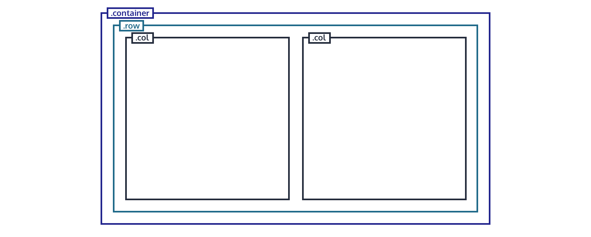

# 0x0B. Implement a design with bootstrap
> ## Specializations - Web Stack programming ― Front-end

### What is bootstrap

Bootstrap is a front-end component library that allows you to prototype your ideas or build an entire website using HTML, CSS, and JavaScript.
Since it was first released by Twitter in 2011, Bootstrap has been a popular choice among web developers. According to builtwith.com, it is used on more than 18 million sites. So clearly, many developers believe it’s a good choice for their projects.

### Advantages of Bootstrap 4

Reduced Development Time
Bootstrap is useful for quickly developing prototypes of your websites and web applications so you can focus on the functionality and structure without implementing a boilerplate to create a responsive and cross-browser compatible front end.
All you need to get started with Bootstrap 4 is a link to the framework’s minified CSS file in your HTML document and some knowledge of HTML, CSS, and JavaScript. 

### The Designs

Let's look at the page designs we'll be implementing so you can understand how they could be broken down into separate sections.
We’re going to start with large screens, and you’ll see how they change for smaller screens (mobiles) later in the course.

## Page Structure

#### Containers

Let’s start with the most basic layout element in Bootstrap, the container. Wrapping your content in a div with the  .container  class creates a centered container that adapts to the width of the viewport and provides horizontal padding for its contents, so they don’t push up against the edges.

#### Bootstrap Grid

Bootstrap 4 has a powerful and flexible grid system that can be used to build all kinds of layouts.
In addition to containers, the Bootstrap grid uses a series of rows and columns to layout content on the page.

## Homepage
The following image shows what the homepage will look like.

#### Desktop

#### Tablet

#### Mobile

## Pricing

Second Template

#### Desktop

#### Tablet

#### Mobile

## Courses

Third Template

#### Desktop

#### Tablet

#### Mobile

